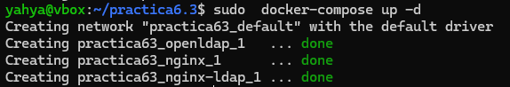
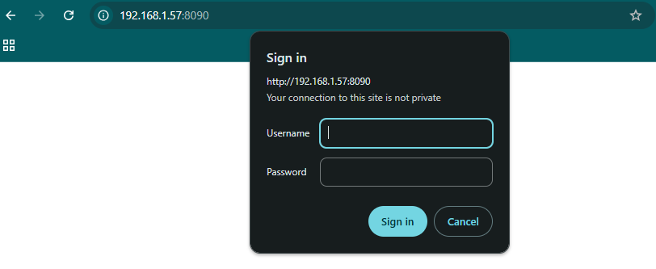
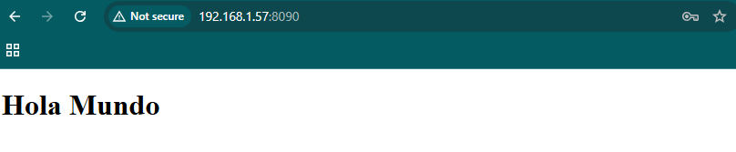
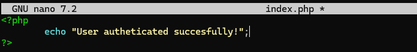
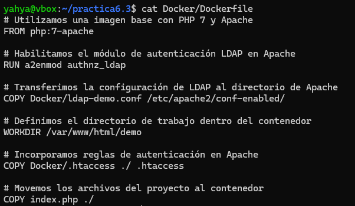
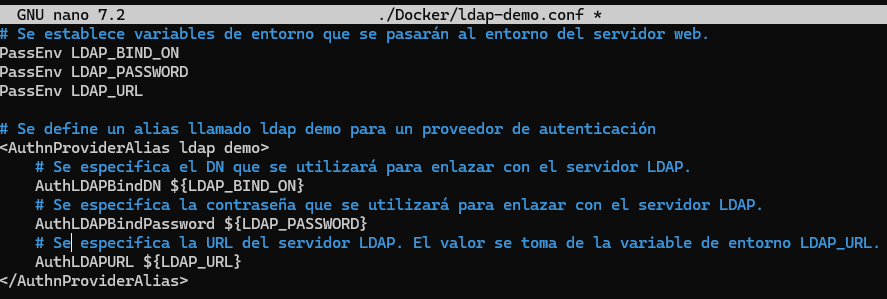
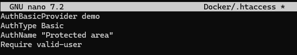
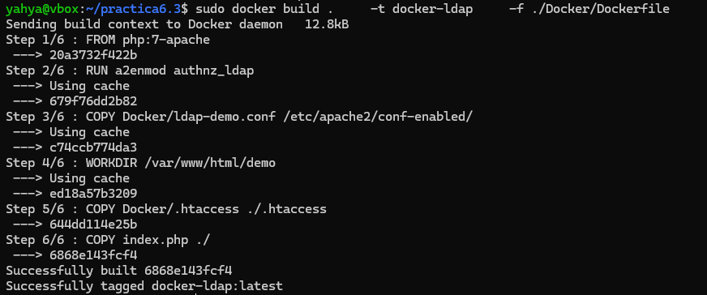
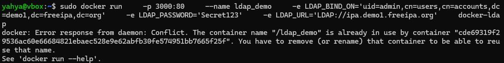
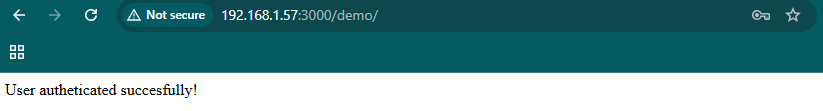

# Práctica 6.2 - Despliegue de servidores web con usuarios autenticados mediante LDAP usando Docker y docker-compose

## Introducción
Esta práctica se enfoca en desplegar servidores web con autenticación de usuarios mediante LDAP utilizando Docker y docker-compose. Los principales componentes son:

## NGINX + demonio de autenticación LDAP + OpenLDAP
Tras conectarnos con ssh a nuestro servidor, creamos la estructura siguiente que es la que vamos a necesitar durante esta práctica

Creamos un html básico con siguiente contenido:

A continuación configuramos nuestro servidor nginx 

Hacemos que escuche el puerto 8090, y que redirige cualquier petición al servicio auth-proxy que a su vez la dirige a otro servicio corriendo en http://nginx-ldap:8888 que es el servicio de autenticación LDAP.

Se establecen los encabezados para la autenticación:

* `proxy_set_header` X-Ldap-URL "ldap://openldap:1389";: Define la URL y puerto del servidor LDAP (openldap:1389).
* `proxy_set_header` X-Ldap-BaseDN "dc=example,dc=org";: Define el Base DN del directorio LDAP.
* `proxy_set_header` X-Ldap-BindDN "cn=admin,dc=example,dc=org";: Define el Bind DN, es decir, la cuenta utilizada para autenticarse en LDAP.
* `proxy_set_header` X-Ldap-BindPass "adminpassword";: Define la contraseña de la cuenta de administración LDAP.

Creamos el archivo `docker-compose.yml` con el siguiente contenido para ejecutar los tres servicios `nginx-ldap` `nginx` y `openldap`:

* **nginx-ldap**  
  * Utiliza la imagen `bitnami/nginx-ldap-auth-daemon-archived`, que es un servicio que se encarga de la autenticación LDAP en Nginx.  
  * Expone el puerto **8888**, lo que significa que este servicio estará disponible en [http://localhost:8888](http://localhost:8888).

* **nginx**  
  * Usa la imagen `bitnami/nginx`, que es una versión de Nginx proporcionada por Bitnami.  
  * Expone el puerto **8090**, lo que significa que el servidor Nginx estará accesible en [http://localhost:8090](http://localhost:8090).  
  * Usa volúmenes para montar archivos locales dentro del contenedor:
    * `./app:/app`: Mapea el directorio `./app` en el host al directorio `/app` en el contenedor.
    * `./conf/ldap_nginx.conf:/opt/bitnami/nginx/conf/server_blocks/ldap_nginx.conf`: Mapea el archivo de configuración `ldap_nginx.conf` al directorio de configuración de Nginx dentro del contenedor.

* **openldap**  
  * Usa la imagen `bitnami/openldap`, que proporciona un servidor LDAP basado en OpenLDAP.  
  * Expone el puerto **1389**, permitiendo el acceso a LDAP en `ldap://localhost:1389`.  
  * Usa variables de entorno para configurar el servidor LDAP:
    * `LDAP_ADMIN_USERNAME=admin`: Define el usuario administrador (`admin`).
    * `LDAP_ADMIN_PASSWORD=adminpassword`: Define la contraseña del administrador.
    * `LDAP_USERS=customuser`: Crea un usuario adicional llamado `customuser`.
    * `LDAP_PASSWORDS=custompassword`: Define la contraseña para `customuser`.

Con el archivo docker-compose.yml creado, se levantarán los contenedores y se comprobará que funcionan correctamente.

Si accedemos a la dirección `http://ip-servidor:8090` deberá aparecer lo siguiente:

Introdcimos las credenciales de acceso y deberíamos poder acceder a la página principal.

## Despliegue con Docker de PHP + Apache con autenticación LDAP

Haciendo uso de la anterior estructura de directorios, se creará un archivo index.php con el siguiente contenido:

En el directorio `Docker` se creará un archivo `Dockerfile` con el siguiente contenido:

Se creará un archivo en el directorio Docker llamado ldap-demo.conf con el siguiente contenido:

Se creará a continuacion en el mismo directorio un archivo `.htaccess` con el siguiente contenido:

* **.htaccess**: es un archivo de configuración utilizado por servidores web Apache. Este archivo permite modificar la configuración del servidor a nivel de directorio, lo que significa que se puede establecer reglas específicas para un directorio o subdirectorio del sitio web sin necesidad de modificar el archivo de configuración global del servidor.

Tras esto, se ejecutará el siguiente comando para construir la imagen:

Si todo ha ido bien, se ejecutará el siguiente comando para levantar el contenedor:

Ahora Si accedemos a la dirección `http://ip-servidor:3000/demo` y nos logueamos con las credenciales de acceso `admin` y `Secret123`, deberá aparecer la siguiente pantalla:

